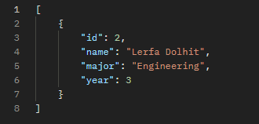

# Lab 4-1: Basic Server

This project has two servers in Node.js:

1. Vanilla **HTTP server** (`http-server.js`)
2. **Express server** (`express-server.js`)

---

## Folder Structure

```
lab-4-1-basic-server/
├── package.json
├── README.md
├── http-server.js
├── express-server.js
└── comparison.md
```

---

## 1️⃣ HTTP Server

* Start server:

```
node http-server.js
```

* Example GET `/`
  `http://localhost:3000/`

  

* Example GET `/students`
  `http://localhost:3000/students`
  
  

* Example GET `/students/1`
  `http://localhost:3000/students/1`
  
  

* Example GET `/students/major/Engineering`
  `http://localhost:3000/students/major/Engineering`
  
  

---

## 2️⃣ Express Server

* Start server:

```
node express-server.js
```

* Example GET `/`
  `http://localhost:3001/`
  
  

* Example GET `/students`
  `http://localhost:3001/students`
  
  

* Example GET `/students/1`
  `http://localhost:3001/students/1`
  
  

* Example GET `/students/major/Engineering`
  `http://localhost:3001/students/major/Engineering`
  
  

* Example GET `/stats`
  `http://localhost:3001/stats`
  
  

---

## 3️⃣ Comparison

Check `comparison.md` for a breakdown of HTTP vs Express.
