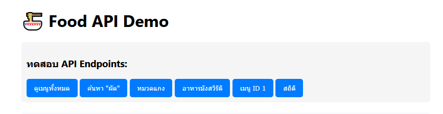
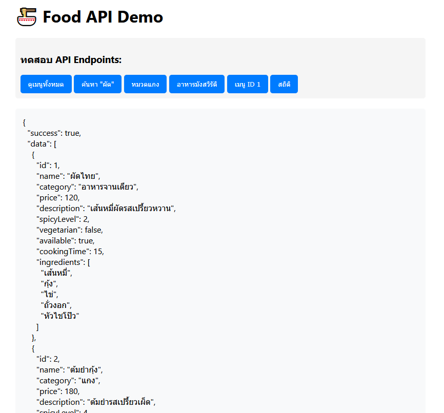
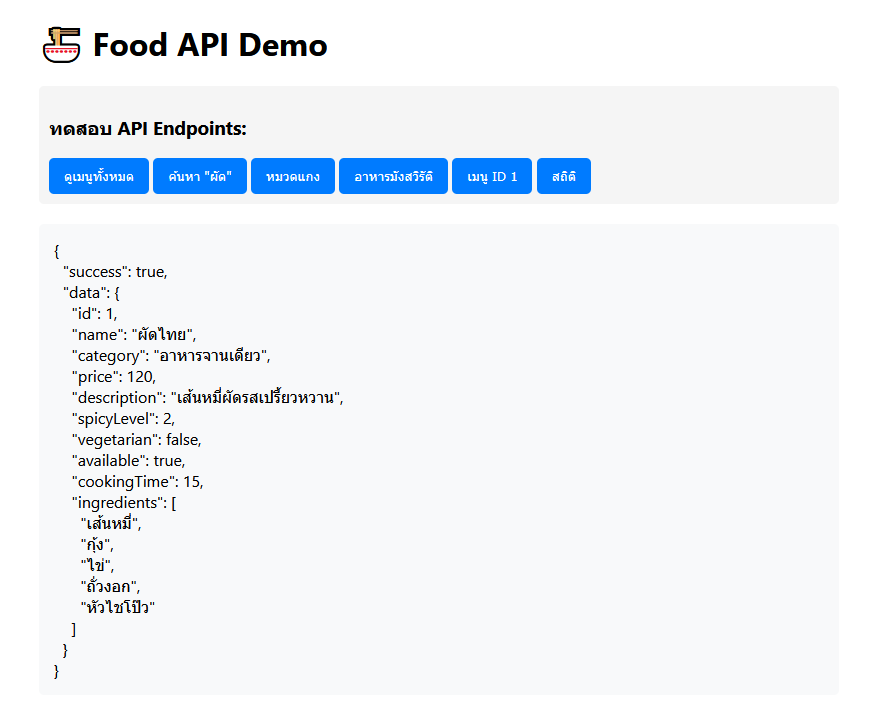
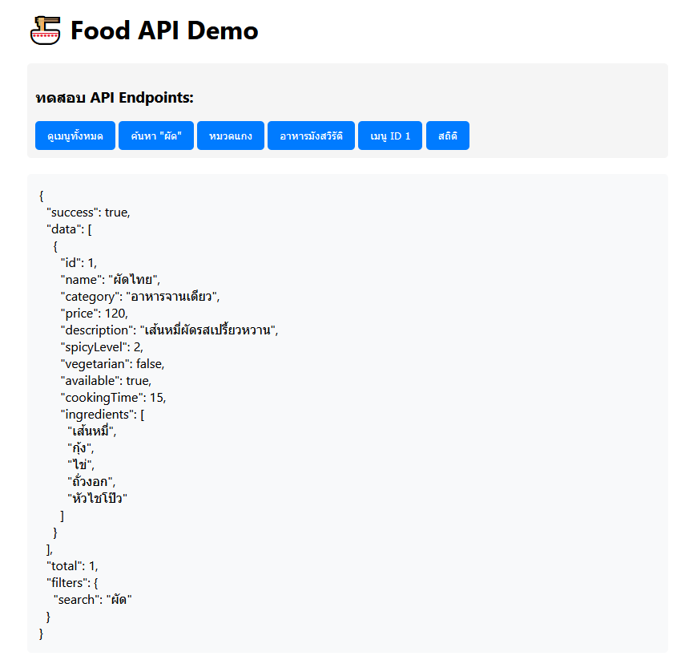
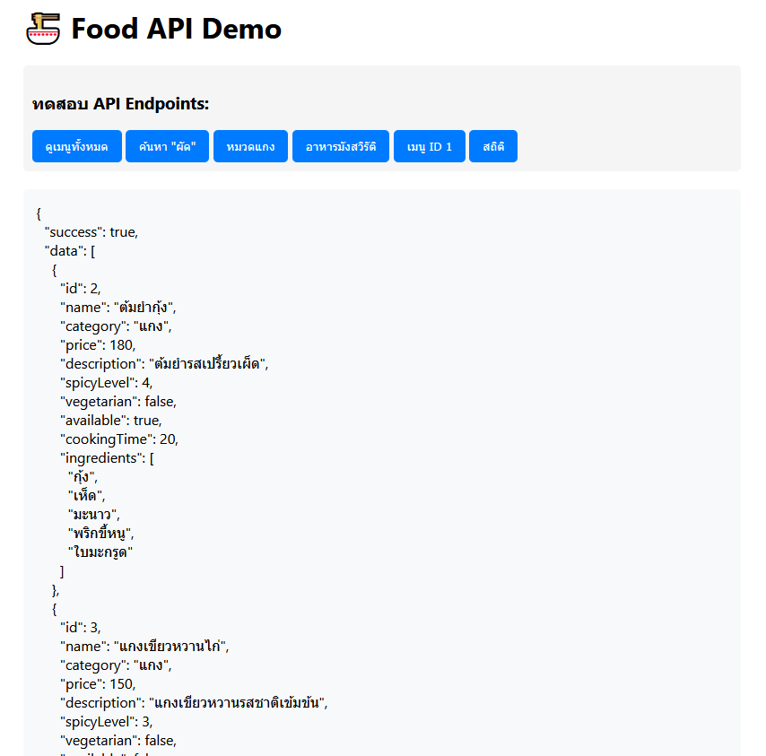
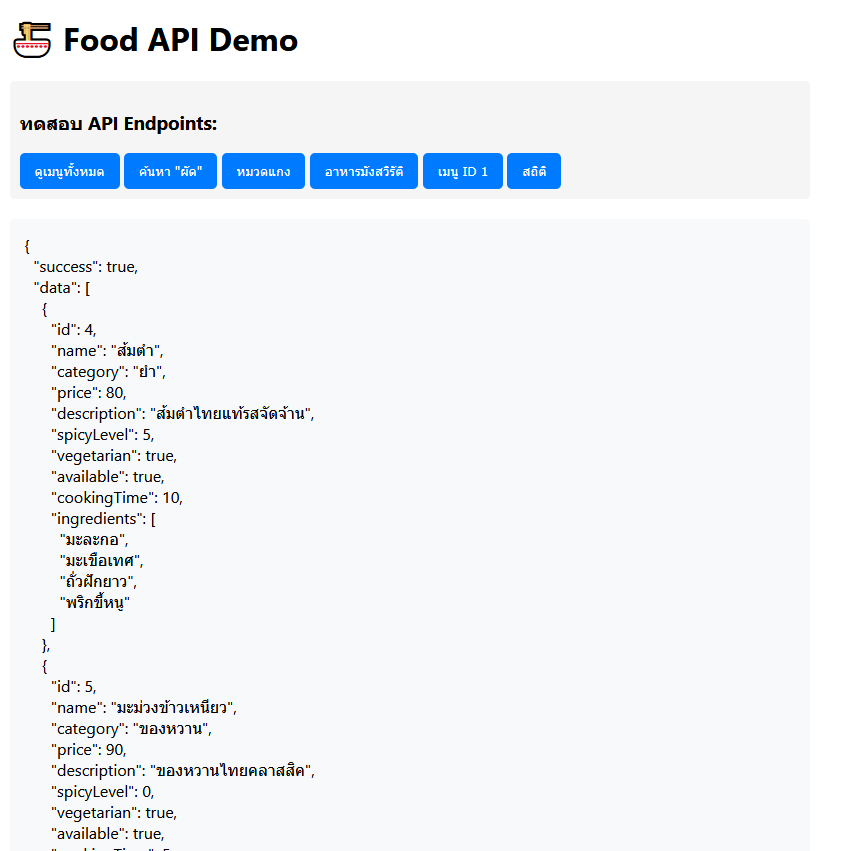
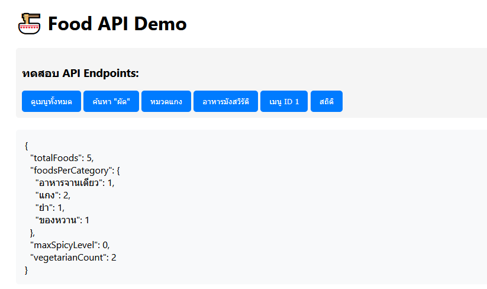

# Lab 4-2: Food API

This project is a Node.js API for food menu management, demonstrating HTTP endpoints, filtering, stats, and a simple front-end demo.

---

## Folder Structure

```
lab-4-2-food-api/
├── package.json
├── README.md
├── server.js
├── data/
│   └── foods.json
├── routes/
│   └── foods.js
├── middleware/
│   └── logger.js
└── public/
    └── index.html
```

---

## 1️⃣ Start Server

```
node server.js
```

Server runs on `http://localhost:3000` by default.

---

## 2️⃣ API Endpoints Showcase

### GET / (Welcome)

`http://localhost:3000/`



### GET /api/foods (All foods)

`http://localhost:3000/api/foods`




### GET /api/foods/:id (Food by ID)

`http://localhost:3000/api/foods/1`



### GET /api/foods?search=stir-fry (Search)

`http://localhost:3000/api/foods?search=stir-fry`



### GET /api/foods?category=curry (Category Filter)

`http://localhost:3000/api/foods?category=curry`



### GET /api/foods?vegetarian=true (Vegetarian Filter)

`http://localhost:3000/api/foods?vegetarian=true`



### GET /api/stats (Statistics)

`http://localhost:3000/api/stats`



---

## 3️⃣ Notes

This README is designed for **showcasing the project**. 
