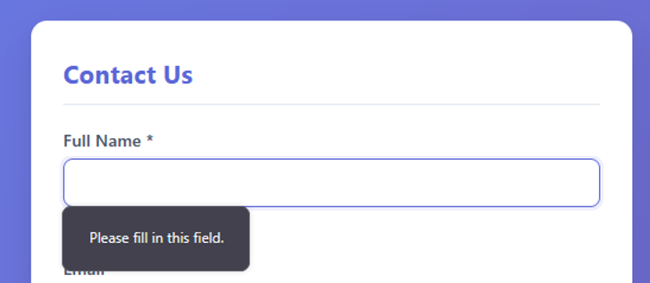
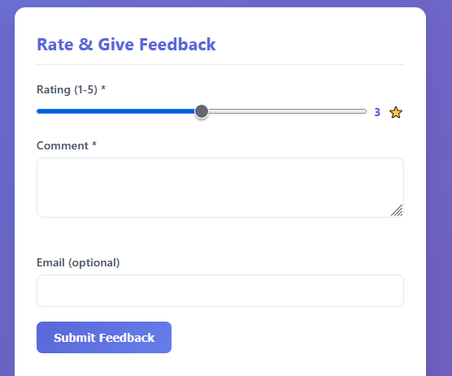
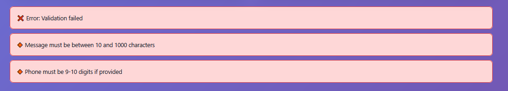
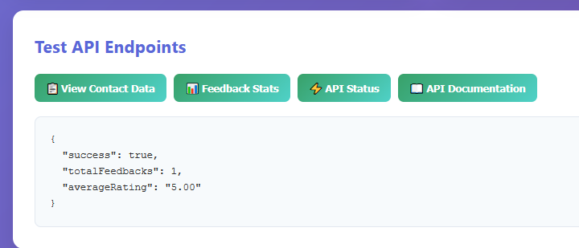
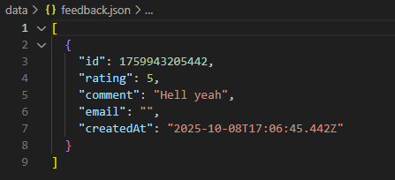
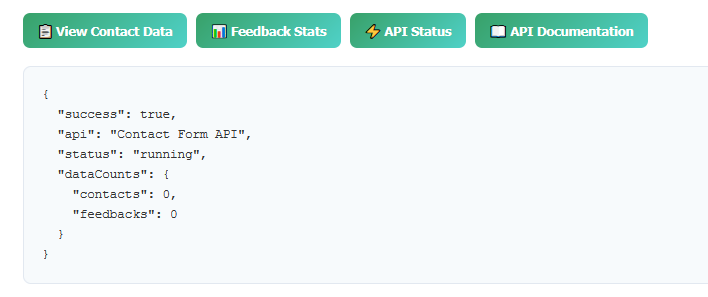
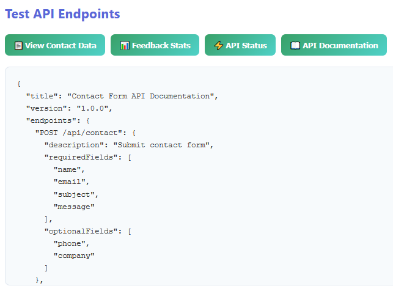

# Lab 4-3: Contact Form API Demo

This project demonstrates a **Contact Form + Feedback Form** with a Node.js + Express backend.

---

## Folder Structure

```
lab-4-3-contact-form/
├── package.json
├── README.md
├── server.js
├── data/
│   ├── contacts.json
│   └── feedback.json
├── middleware/
│   ├── validation.js
│   └── fileManager.js
├── routes/
│   ├── contact.js
│   └── feedback.js
└── public/
    ├── index.html
    ├── style.css
    └── script.js
```

---

## 1️⃣ Contact Form

* **Fields:** Name, Email, Phone (optional), Company (optional), Subject, Message
* **Submit:** POST `/api/contact`
* **Validation:** All required fields checked, optional fields validated if filled

**Example Screenshot:**




---

## 2️⃣ Feedback Form

* **Fields:** Rating (1-5), Comment, Email (optional)
* **Submit:** POST `/api/feedback`
* **Validation:** Rating must be 1-5, Comment required, optional Email format check

**Example Screenshot:**



---

## 3️⃣ Status Messages

* Displays success or error messages for form submissions
* Auto disappears after 5 seconds

**Example Screenshot:**



---

## 4️⃣ API Testing Functions (Frontend)

Buttons to test endpoints directly from the UI:

| Button               | Function                       |
| -------------------- | ------------------------------ |
| 📋 View Contact Data | GET `/api/contact` (paginated) |
| 📊 Feedback Stats    | GET `/api/feedback/stats`      |
| ⚡ API Status         | GET `/api/status`              |
| 📖 API Documentation | GET `/api/docs`                |

**View Contact Data**

\

**Feedback Stats**





**API Status**



**API Documentation**



---

## 5️⃣ How to Run

```bash
# Install dependencies
npm install

# Start server
node server.js
```

* Open `http://localhost:3000` (or the port you set) in your browser
* Fill out forms and test API buttons

---

## Notes

* Frontend handles client-side validation + real-time updates
* Backend handles server-side validation, file storage, and API responses
* All JSON data stored in `data/contacts.json` and `data/feedback.json`
